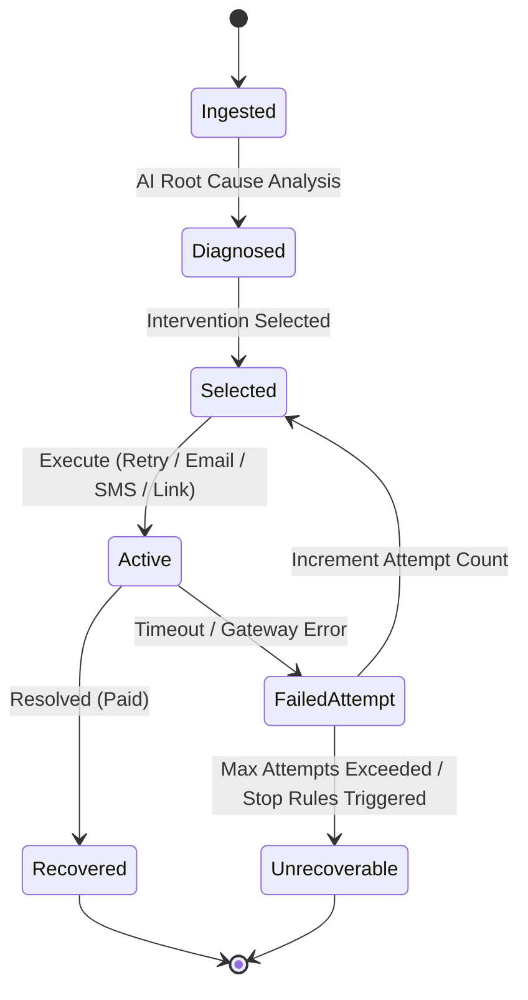

# System Architecture Blueprint

This document details the engineering architecture for the **AI Revenue Recovery Agent**, compiled for the Razorpay AI Buildathon 2026.

---

## 1. Product Purpose

The AI Revenue Recovery Agent is built to resolve payment failures, checkout abandonment, and subscription/invoice slips autonomously. Instead of relying on static retry rules, it implements a closed-loop intelligence cycle: **Detect → Diagnose → Intervene → Execute → Measure**, allowing merchant systems to adapt dynamically to specific customer and transaction profiles.

---

## 2. Planned Ingestion/Detection Pipeline

The agent intercepts transaction lifecycle events directly from gateways (e.g., Razorpay webhooks) or invoicing databases.
* **Ingestion Channels:** Webhook listeners, polling database queries, CRM/ERP triggers.
* **Queuing:** Queue workers sort incoming event objects by merchant ID and category, standardizing them into a common `RevenueEvent` format.
* **Pre-processing:** Deduplication and correlation routines map checkout dropoffs to previous payment failure history to prevent redundant retry logs.

---

## 3. Frontend Architecture

The React dashboard serves as the control center, allowing merchants to observe and control recovery actions.
* **Tech Stack:** React 18, TypeScript, Vite (bundler), Tailwind CSS (visual design matching the reference image layout).
* **Navigation Shell:** Responsive flex layout featuring Sidebar, Header, and tab-level pages.
* **Service Client:** Background polling workers query the FastAPI health endpoints every few seconds to verify service connectivity.
* **State Management:** Local React state for navigation, status verification, and modular state handlers for metrics.

---

## 4. Backend Architecture

The Python server handles the heavy lifting of state transitions, database access, and future model execution.
* **Tech Stack:** Python 3.10+, FastAPI (asynchronous API routes), Uvicorn (ASGI application server).
* **CORS Support:** Integrated middleware dynamically whitelist frontend requests from Vite host environments.
* **Directory Strategy:** Dedicated structure segregating core routes (`api/`), type schemas (`models/`), business rules (`services/`), configuration (`core/`), and helpers (`utils/`).

---

## 5. Future Recovery Engine

The recovery execution engine will operate as a finite state machine:

* **Stopping Rules:** Safety limits on retry frequency and count to prevent customer spamming.
* **Execution Hooks:** Gateway re-routes and dispatch wrappers for notification providers.

---

## 6. Future Audit Trail

A tamper-proof ledger is built to capture every state modification for troubleshooting and merchant auditing.
* **Entities Logged:** Gateway alerts, AI model decisions, SMS delivery receipts, customer email link clicks.
* **Attributes:** Unique audit IDs, actor categorization (System, Merchant, Customer), action types, and structured detail blocks.

---

## 7. Future Metrics Engine

Computes conversion ratios and recovered revenue aggregates for financial bookkeeping.
* **Core Indicators:** Total Revenue at Risk, Recovered Revenue Sum, Recovery Conversion Rate, and Active Run counts.
* **Data Refresh:** Pushed updates or websocket triggers will refresh dashboard Recharts logs immediately upon payment status webhook receipts.

---

## 8. Future Cross-Border Module

A separate intelligence module designed to handle cross-border complications:
* **Foreign Exchanges:** Smart handling of international cards and dynamic currency conversions (DCC).
* **Compliance Checks:** Geo-specific transaction limits, regulatory controls (e.g. SCA/3DS mandates), and regional holiday scheduling logic.

---

## 9. Incremental Development Rationale

Building the agent in separate development sprints ensures structural integrity:
1. **Foundation (Part 1 - Present):** Lock down the visual identity (matching the reference image), configure dependencies, define TypeScript types, and setup server connectivity. This prevents styling divergence or configuration conflicts in future sprints.
2. **Intelligence Connection (Part 2):** Connect synthetic database loaders, build the AI diagnostics routines, implement the state machine retry logic, and activate dashboard analytics.
3. **Execution Integration (Part 3):** Bind live APIs, email servers, SMS clients, and live sandbox checkouts.
